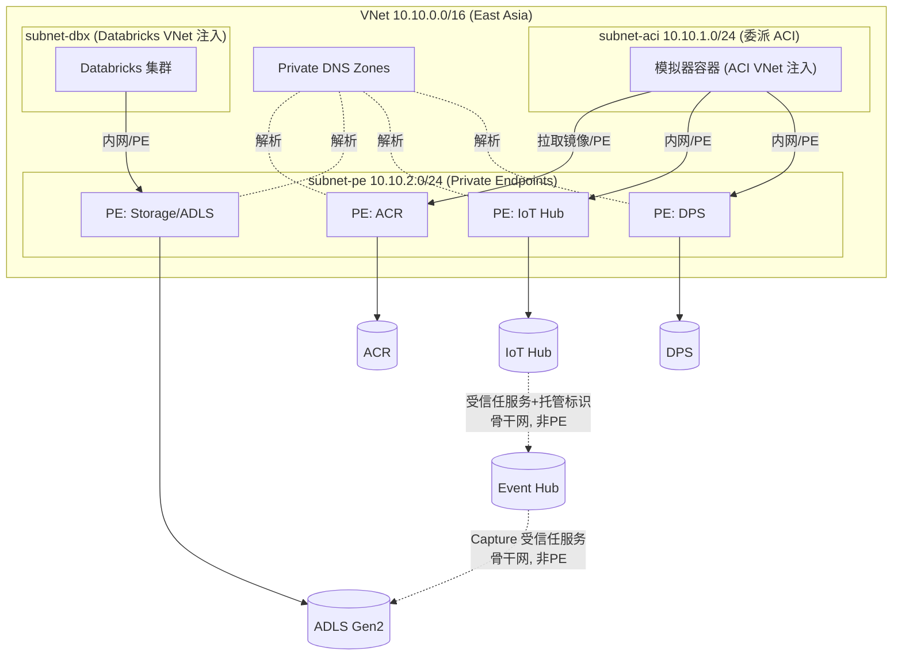
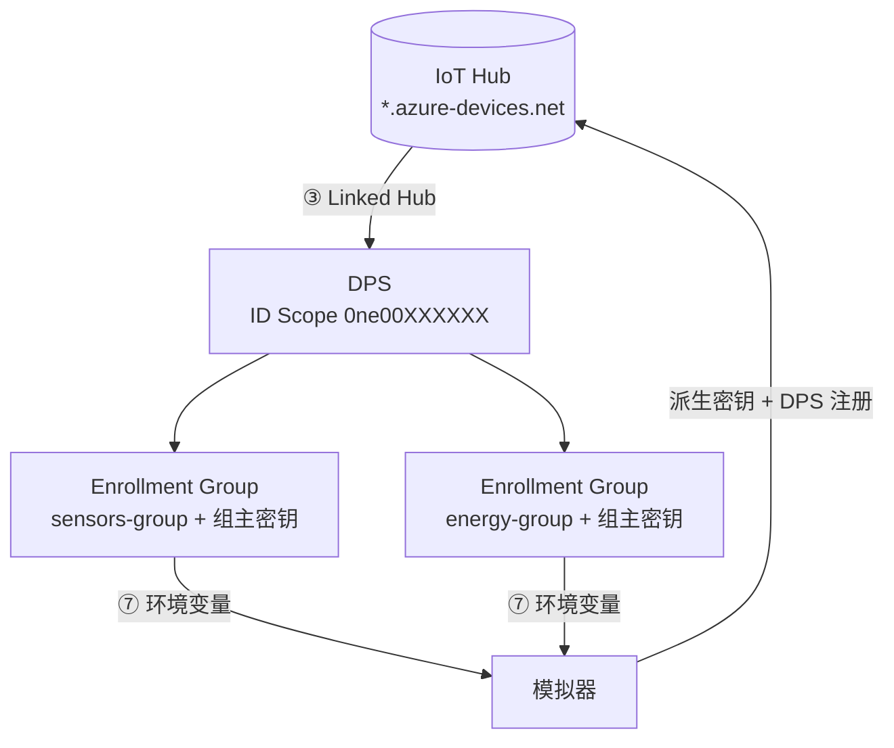

# IoT 设备模拟器 — 多设备发送配置手册

## 一、整体架构

### 1.1 数据流总览

```
┌──────────────────────────────────────────────────────────────┐
│  iot_device_simulator.py (本地运行)                          │
│  ┌──────────┐ ┌──────────┐ ┌──────────┐ ┌──────────┐       │
│  │ wsd-01   │ │ cn-01    │ │ device-6 │ │ device-28│ ...   │
│  │ 温湿度计  │ │ 储能系统  │ │ 电力计量  │ │ 锅炉     │       │
│  └────┬─────┘ └────┬─────┘ └────┬─────┘ └────┬─────┘       │
│       │            │            │            │              │
│       └────────────┴────────────┴────────────┘              │
│                         │ MQTT/AMQP                         │
└─────────────────────────┼───────────────────────────────────┘
                          ▼
                 ┌─────────────────┐
                 │   Azure DPS     │  ← 设备经对称密钥组自动注册
                 └────────┬────────┘
                          │ (分配 IoT Hub)
                          ▼
                 ┌─────────────────┐
                 │  Azure IoT Hub  │
                 └────────┬────────┘
                          │ (消息路由)
                          ▼
                 ┌─────────────────┐
                 │  Azure Event Hub │ (内置端点或自定义端点)
                 └────────┬────────┘
                          │ (Capture → Avro)
                          ▼
                 ┌─────────────────┐
                 │  Azure ADLS Gen2 │
                 └────────┬────────┘
                          │
                          ▼
                 ┌─────────────────┐
                 │  Databricks      │
                 └─────────────────┘
```

### 1.2 组件职责与选型

| 层 | 组件 | 职责 | 选型要点 |
|---|---|---|---|
| 设备/采集 | 模拟器 (本地 / ACI 容器) | 模拟 13 台工业设备，DPS 注册后发送遥测 | 生产环境替换为真实设备或边缘网关 (IoT Edge) |
| 注册 | **Azure DPS** | 对称密钥 Enrollment Group，零接触自动注册并分配 Hub | 量产首选，避免分发高权限凭据 |
| 接入 | **Azure IoT Hub** | 设备身份、双向通信、消息路由、Device Twin | 层级按消息量选 (测试 F1，生产 S1/S2/S3) |
| 缓冲 | **Event Hub** | 高吞吐消息缓冲，解耦上下游 | 可直接用 IoT Hub 内置兼容端点；高并发或多消费组时另建 |
| 存储 | **Storage + ADLS Gen2** | 冷/温数据湖存储 (Avro/Parquet) | 启用分层命名空间 (HNS)，配合 Event Hub Capture |
| 分析 | **Databricks** | 流/批处理、特征工程、建模 | 按需用 Auto Loader 增量摄取 ADLS |

### 1.3 网络设计（尽量走内网）
为减少公网暴露面，建议将平台资源放入同一 VNet。**注意区分两类连接**：

- **客户端 → 服务（经 Private Endpoint 走内网）**：由 VNet 内的计算（ACI、Databricks）主动发起的访问，可经私有终结点进入服务。
- **服务 → 服务（PaaS 后端，走 Microsoft 骨干，不经 PE）**：IoT Hub、Event Hub 等 PaaS **没有 VNet 出站能力**，它们之间的投递（IoT Hub 路由 → Event Hub、Event Hub Capture → ADLS）走 Azure 内部骨干网，**不会也无法穿过客户的 Private Endpoint**。这类目标若关闭公网，需用「**允许受信任的 Microsoft 服务**」防火墙例外 + **托管标识**放行，而不是建 PE。

Azure 国际版完整支持 Private Link 与上述受信任服务例外。



**关键设计原则**

| 项 | 建议 |
|---|---|
| VNet 规划 | 单 VNet 多子网：`subnet-aci`(委派 `Microsoft.ContainerInstance/containerGroups`)、`subnet-pe`(Private Endpoint)、`subnet-dbx`(Databricks 注入需 host/container 两个子网) |
| 客户端经 PE 接入 | **DPS、IoT Hub、ACR** 供 ACI 访问，**Storage/ADLS** 供 Databricks 访问 → 这些建 Private Endpoint，并**关闭公网访问** |
| 服务到服务（不建 PE） | **IoT Hub 路由 → Event Hub**、**Event Hub Capture → ADLS** 走骨干网；目标关闭公网时启用「允许受信任的 Microsoft 服务绕过防火墙」+ 托管标识，**无需为 Event Hub 建 PE**，ADLS 的 PE 仅服务于 Databricks 读取 |
| 私有 DNS | 为每个建了 PE 的服务建对应 Private DNS Zone 并链接 VNet（见下表） |
| 出站控制 | ACI 子网经 NAT Gateway 或防火墙统一出站；仅放行 `az login`/镜像构建等必要流量 |
| 凭据 | 组主密钥、连接串通过安全环境变量 / Key Vault (启用 PE) 注入，禁止入库入镜像 |

> **Event Hub 是否需要 PE？** 仅当 VNet 内有自定义消费者（如某个内网服务直接读 Event Hub）时才需要。本架构中 Event Hub 的下游是 Capture（服务到服务），上游是 IoT Hub 路由（服务到服务），两端都不经 PE，因此**默认不为 Event Hub 建 PE**。

**国际版 Private DNS Zone 名称**

| 服务 | Private DNS Zone | 本架构是否需要 PE |
|---|---|---|
| IoT Hub | `privatelink.azure-devices.net` | 需要（ACI 访问） |
| DPS | `privatelink.azure-devices-provisioning.net` | 需要（ACI 访问） |
| Event Hub | `privatelink.servicebus.windows.net` | 默认不需要（仅服务到服务） |
| Blob / ADLS | `privatelink.blob.core.windows.net` / `privatelink.dfs.core.windows.net` | 需要（Databricks 访问） |
| ACR | `privatelink.azurecr.io` | 需要（ACI 拉镜像） |
| Key Vault | `privatelink.vaultcore.azure.net` | 推荐（凭据托管） |

> **测试 vs 生产**：F1 免费版 IoT Hub 与 ACI 公网部署适合快速验证（本手册默认路径）。生产环境建议按上表收敛到内网，并把模拟器替换为真实设备 / IoT Edge 网关。设备若在工厂现场，通过专线 (ExpressRoute) 或 VPN 接入 VNet，再经私有终结点访问 IoT Hub。

## 二、环境准备

### 2.1 Python 依赖安装

```powershell
pip install azure-iot-device
```

| 包名 | 用途 | 最低版本 |
|---|---|---|
| `azure-iot-device` | 设备端 SDK，DPS 注册 + 模拟设备发送遥测 | 2.12+ |
| `azure-iot-hub` | (仅兼容旧版 iothubowner 自动注册路径需要) | 2.6+ |

### 2.2 Azure 资源准备

在 Azure Portal 上确保以下资源就绪：

| 资源 | 说明 |
|---|---|
| **IoT Hub** | 任意层级 (F1 免费版即可测试, 每天 8000 条消息) |
| **DPS (Device Provisioning Service)** | 设备注册入口, 链接到 IoT Hub (详见 §2.3) |
| **Event Hub** (可选) | IoT Hub 内置兼容端点已包含 Event Hub；如需自定义路由则另建 |
| **Storage Account + ADLS Gen2** (可选) | 配合 Event Hub Capture 使用 |

### 2.3 IoT Hub + DPS 端配置详解

多设备模式使用 **DPS + 对称密钥 Enrollment Group** 注册设备（更贴近真实量产场景，无需分发 iothubowner 高权限密钥）。下面给出 Azure **国际版**（区域 East Asia）的完整配置步骤，含 Portal 与 Azure CLI 两种方式。测试环境将部署在国际版上。

> 前置：CLI 操作前先登录国际版。
> ```powershell
> az cloud set --name AzureCloud
> az login
> az account set --subscription "<你的订阅ID>"
> ```

#### 步骤 ① 创建 IoT Hub

**Portal**：Azure Portal（portal.azure.com）→ 创建资源 → IoT Hub → 选择资源组、区域（East Asia 等）、名称与层级（测试可用 F1）。

**CLI**：
```powershell
az iot hub create `
  --name <your-hub> `
  --resource-group <rg> `
  --location eastasia `
  --sku S1
```

> 国际版 IoT Hub 主机名形如 `<your-hub>.azure-devices.net`。

#### 步骤 ② 创建 DPS 实例

**Portal**：创建资源 → IoT Hub Device Provisioning Service → 同一资源组/区域、命名。

**CLI**：
```powershell
az iot dps create `
  --name <your-dps> `
  --resource-group <rg> `
  --location eastasia
```

#### 步骤 ③ 把 DPS 链接到 IoT Hub

DPS 注册成功后要把设备分配到哪个 Hub，需先建立链接。

**Portal**：DPS → 设置 → 链接的 IoT 中心 → 添加 → 选择目标 IoT Hub（使用 iothubowner 访问策略）。

**CLI**：
```powershell
# 取 IoT Hub 连接字符串 (仅本步链接用, 设备运行不需要)
$hubConn = az iot hub connection-string show `
  --hub-name <your-hub> --policy-name iothubowner --query connectionString -o tsv

az iot dps linked-hub create `
  --dps-name <your-dps> `
  --resource-group <rg> `
  --connection-string $hubConn `
  --location eastasia
```

#### 步骤 ④ 记录 DPS 的 ID Scope

**Portal**：DPS → 概览 → **ID Scope**（形如 `0ne00XXXXXX`）。

**CLI**：
```powershell
az iot dps show --name <your-dps> --resource-group <rg> --query properties.idScope -o tsv
```

> 本项目用了两个组（`sensors-group`、`energy-group`）。它们**可以在同一个 DPS**（共用同一 ID Scope），也可以分属两个 DPS（各自 ID Scope）。配置文件通过 `DPS_IDSCOPE_SENSORS` / `DPS_IDSCOPE_ENERGY` 两个环境变量分别指定，同 DPS 时填相同值即可。

#### 步骤 ⑤ 创建两个对称密钥 Enrollment Group

**Portal**：DPS → Manage enrollments → **Enrollment groups** → + Add：
- **Group name**：`sensors-group`（再建一个 `energy-group`）
- **Attestation type**：**Symmetric Key**
- **Auto-generate keys**：勾选（DPS 生成组主密钥）
- **Select how you want to assign devices to hubs**：选目标 IoT Hub 与分配策略（如 Evenly weighted）
- **Initial Device Twin（可选）**：可在此预置组级 tags（模拟器也会在运行时上报，二选一或叠加）

**CLI**：
```powershell
az iot dps enrollment-group create `
  --dps-name <your-dps> --resource-group <rg> `
  --enrollment-id sensors-group

az iot dps enrollment-group create `
  --dps-name <your-dps> --resource-group <rg> `
  --enrollment-id energy-group
```

#### 步骤 ⑥ 获取每个组的组主密钥（Primary Key）

**Portal**：DPS → Enrollment groups → 选择组 → **Primary Key**（base64 字符串）。

**CLI**：
```powershell
az iot dps enrollment-group show `
  --dps-name <your-dps> --resource-group <rg> `
  --enrollment-id sensors-group `
  --query "attestation.symmetricKey.primaryKey" -o tsv

az iot dps enrollment-group show `
  --dps-name <your-dps> --resource-group <rg> `
  --enrollment-id energy-group `
  --query "attestation.symmetricKey.primaryKey" -o tsv
```

#### 步骤 ⑦ 把 ID Scope 与组主密钥配置给模拟器

通过环境变量传入（详见 §3 步骤 2），**切勿写入配置文件或提交 git**：
```powershell
$env:DPS_IDSCOPE_SENSORS  = '0ne00XXXXXX'
$env:DPS_GROUPKEY_SENSORS = '<sensors 组 Primary Key>'
$env:DPS_IDSCOPE_ENERGY   = '0ne00XXXXXX'   # 同一 DPS 则与上面相同
$env:DPS_GROUPKEY_ENERGY  = '<energy 组 Primary Key>'
```

#### 配置关系总览



#### 验证（设备注册后）

设备首次注册成功后，可查看每个组实际注册进来的设备：
```powershell
az iot dps enrollment-group registration-state list `
  --dps-name <your-dps> --resource-group <rg> `
  --enrollment-id sensors-group -o table

# IoT Hub 侧确认设备已自动创建
az iot hub device-identity list --hub-name <your-hub> -o table
```

> **安全提示**: 组主密钥是最高敏感凭据，只通过环境变量传入模拟器，**切勿写入配置文件或提交到 git**。设备端不持有组主密钥，模拟器按 `registration_id`(=device_id) 派生每台设备的专属密钥。iothubowner 仅在上面 ③ 链接 DPS 时使用一次，设备运行阶段完全不需要。

### 2.4 其他 Azure 资源部署建议（IoT Hub 之外）

下游数据平台资源按需部署。以下给出推荐配置、国际版 CLI 命令与内网化要点。

#### 2.4.1 Event Hub（消息缓冲）

- **何时需要**：默认可直接用 IoT Hub 的**内置兼容端点**（已是 Event Hub 协议），无需单独创建；当需要独立消费组、更高吞吐、或把多源数据汇聚时再建独立 Event Hub，并在 IoT Hub 配置**自定义路由**指向它。
- **选型**：命名空间 Standard（支持 20 消费组、Capture）；分区数按峰值吞吐与并行消费者估算（一个分区约 1 MB/s 入），分区数创建后不可减少，宜适度预留。
- **内网**：IoT Hub 路由属**服务到服务**投递（走骨干网，非 PE）。Event Hub 关闭公网时，启用「允许受信任的 Microsoft 服务绕过防火墙」并用**托管标识**作为 IoT Hub 路由终结点凭据即可，**默认无需为 Event Hub 建 Private Endpoint**；仅当 VNet 内有自定义消费者直接读取时才建 PE（`privatelink.servicebus.windows.net`）。

```powershell
az eventhubs namespace create -g <rg> -n <ehns> -l eastasia --sku Standard
az eventhubs eventhub create -g <rg> --namespace-name <ehns> -n telemetry `
  --partition-count 4 --message-retention 1
# IoT Hub 自定义路由（可选）：先建 Event Hub 终结点再加路由规则
```

#### 2.4.2 Storage Account + ADLS Gen2（数据湖）

- **必须启用分层命名空间 (HNS)** 才是 ADLS Gen2；冗余测试用 LRS，生产可 ZRS/GRS。
- 配合 **Event Hub Capture** 自动把流数据落为 Avro，或用 Databricks Auto Loader 增量摄取。
- **内网**：**Event Hub Capture → ADLS 是服务到服务**写入（走骨干网，非 PE）。存储关闭公网时，启用「允许受信任的 Microsoft 服务绕过防火墙」即可放行 Capture。存储的 **Private Endpoint 主要服务于 Databricks 的内网读取**：为 `blob` 与 `dfs` 两个子资源各建 PE，分别链接 `privatelink.blob.*` 与 `privatelink.dfs.*`。

```powershell
az storage account create -g <rg> -n <stacct> -l eastasia `
  --sku Standard_LRS --kind StorageV2 --hierarchical-namespace true
az storage container create --account-name <stacct> -n raw --auth-mode login
```

#### 2.4.3 容器与镜像（ACR + ACI）

- **ACR**：存放模拟器镜像；生产建议 Premium SKU（支持 Private Endpoint、内容信任、geo 复制），测试 Basic 即可。`deploy-to-azure.ps1` 会自动创建。
- **ACI**：运行模拟器；内网部署时用 `--vnet`/`--subnet` 把容器组注入委派子网，经私有终结点访问 IoT Hub/DPS/ACR。
- 详见 §九 的一键 / 分步部署。

```powershell
# 内网 ACI 示例（在已委派的子网中运行）
az container create -g <rg> --name iot-simulator `
  --image <acr>.azurecr.io/iot-device-simulator:latest `
  --os-type Linux `
  --vnet <vnet> --subnet subnet-aci `
  --cpu 0.5 --memory 0.5 --restart-policy Always
```

#### 2.4.4 Databricks（分析）

- **VNet 注入**：创建工作区时选「Deploy to your own VNet」，提供 host/container 两个专用子网，使集群在你的网络内，经私有终结点访问 ADLS。
- 用 **Unity Catalog + Auto Loader** 增量读取 `raw` 容器，避免全量扫描。
- 通过 **Access Connector / 托管标识** 访问存储，免密钥。

#### 2.4.5 Key Vault（凭据托管，推荐）

- 把 DPS 组主密钥、连接串存入 Key Vault，ACI/Databricks 经托管标识读取，替代明文环境变量。
- 启用 Private Endpoint（`privatelink.vaultcore.azure.net`）并关闭公网访问。

```powershell
az keyvault create -g <rg> -n <kv> -l eastasia --enable-rbac-authorization true
az keyvault secret set --vault-name <kv> -n DPS-GROUPKEY-SENSORS --value "<密钥>"
```

#### 部署顺序建议

1. 资源组 + VNet/子网 + Private DNS Zones
2. IoT Hub + DPS + Enrollment Groups（§2.3）
3. （可选）Event Hub / Storage(ADLS) / Key Vault + 各自 Private Endpoint
4. ACR + 构建镜像 + ACI 部署模拟器（§九）
5. Databricks 工作区接入 ADLS 做分析

> 测试阶段可跳过 3/5 与全部内网化，仅用 IoT Hub + ACI 即可跑通端到端（§三、§九）。

---

## 三、快速开始 (3 步)

### 步骤 1：生成配置文件

```powershell
cd C:\Users\JieYin\Downloads\iot_simulator
python iot_device_simulator.py --init-config
```

生成 `simulator_config.json`（DPS 对称密钥 Enrollment Group 方式）：

```json
{
  "send_interval_seconds": 10,
  "message_count": 0,
  "dps": {
    "provisioning_host": "global.azure-devices-provisioning.net",
    "enrollment_groups": {
      "sensors-group": {
        "id_scope_env": "DPS_IDSCOPE_SENSORS",
        "group_master_key_env": "DPS_GROUPKEY_SENSORS",
        "initial_twin_tags": {"site": "shanghai-plant-01", "environment": "prod", "firmwareTrack": "stable"}
      },
      "energy-group": {
        "id_scope_env": "DPS_IDSCOPE_ENERGY",
        "group_master_key_env": "DPS_GROUPKEY_ENERGY",
        "initial_twin_tags": {"site": "shanghai-plant-02", "environment": "prod", "firmwareTrack": "canary"}
      }
    }
  },
  "devices": [
    {"device_id": "device-wsd-01", "device_type": "temperature_humidity", "group": "sensors-group", "tags": {"line": "L1", "criticality": "normal"}},
    {"device_id": "my-device-6",   "device_type": "power_meter",         "group": "energy-group",  "tags": {"line": "P1", "criticality": "high"}}
  ]
}
```

> 设备按 `group` 字段归属到两个 Enrollment Group：`sensors-group`（温湿度/燃气/水表）与 `energy-group`（电力/光伏/锅炉/冷机等）。每个组的 `initial_twin_tags` 模拟组级初始 twin 标签，设备级 `tags` 再叠加。

### 步骤 2：通过环境变量提供 id_scope 与组主密钥

组主密钥属于敏感凭据，**不写入配置文件、不提交 git**，改用环境变量传入：

```powershell
$env:DPS_IDSCOPE_SENSORS  = '0ne00XXXXXX'
$env:DPS_GROUPKEY_SENSORS = '<sensors 组主密钥 base64>'
$env:DPS_IDSCOPE_ENERGY   = '0ne00YYYYYY'
$env:DPS_GROUPKEY_ENERGY  = '<energy 组主密钥 base64>'
```

> 组主密钥获取：Azure Portal → DPS → Manage enrollments → Enrollment groups → 选择组 → Primary Key。模拟器仅用它在本地为每台设备按 `registration_id`(=device_id) 派生专属密钥。

### 步骤 3：启动多设备模拟

```powershell
python iot_device_simulator.py --mode multi --config simulator_config.json
```

脚本会自动完成（模拟真实设备端行为）：
1. 为每台设备按 registration_id 派生对称密钥（HMAC-SHA256）
2. 通过 DPS 注册，获取分配的 IoT Hub 与 device_id
3. 用派生密钥连接分配到的 IoT Hub
4. 上报设备元数据到 device twin（reported properties），并为每条遥测附带自定义消息属性（site/deviceType/criticality 等，可用于路由）
5. 按配置的间隔并发发送遥测数据

---

## 四、配置文件详解

### 4.1 全局参数

| 字段 | 类型 | 说明 |
|---|---|---|
| `send_interval_seconds` | number | 每个设备的发送间隔 (秒) |
| `message_count` | number | 每个设备发送的消息总数 (0 = 无限循环) |
| `dps.provisioning_host` | string | DPS 全局终结点 (Azure 国际版默认 `global.azure-devices-provisioning.net`) |
| `dps.enrollment_groups` | object | Enrollment Group 定义，键为组名 |

每个 Enrollment Group 包含：

| 字段 | 说明 |
|---|---|
| `id_scope_env` | 存放该组 ID Scope 的**环境变量名** |
| `group_master_key_env` | 存放该组**组主密钥**的环境变量名（密钥本身不入库） |
| `initial_twin_tags` | 组级初始 twin 标签 (site/environment/firmwareTrack 等) |

> 兼容说明：若配置文件改为含 `iothub_connection_string`（iothubowner）而无 `dps` 段，则回退到旧版「IoT Hub 服务连接字符串自动注册」方式。

### 4.2 设备列表

每个设备条目包含：

| 字段 | 说明 |
|---|---|
| `device_id` | 设备ID，同时作为 DPS 注册的 registration_id |
| `device_type` | 设备类型，决定生成的遥测数据格式 |
| `group` | 所属 Enrollment Group 名称 (对应 `dps.enrollment_groups` 的键) |
| `tags` | 设备级标签，叠加在组级 `initial_twin_tags` 之上 |

### 4.3 可用设备类型

| device_type | 说明 | 测点数 | 数据特征 |
|---|---|---|---|
| `temperature_humidity` | 温湿度计 | 7 | 温度 15~40°C, 湿度 10~80% |
| `energy_storage` | 储能 PCS/BMS | 100 | 电池SOC, 充放电状态, IGBT温度 |
| `power_meter` | 配电回路电表 | 42 | 10个回路的电能(递增)+三相电流 |
| `solar_panel` | 光伏并网柜 | 14 | 3组光伏的有功电能+三相电流 |
| `boiler` | 锅炉系统 | 32 | 2台锅炉温度/压力/运行状态 |
| `chiller` | 冷水机组 | 43 | 3台主机+水泵+冷却塔运行数据 |
| `compressed_air` | 压缩空气流量计 | 10 | 瞬时/累计流量, 温度, 压力 |
| `substation_meter` | 变电所多回路电表 | 42 | 5个回路的电压/电流/电能/负载 |
| `gas_flow` | 天然气流量计 | 6 | 4条产线天然气用量 |
| `water_meter` | 水表+燃气表 | 11 | 多路累计流量+燃气瞬时/累计 |

### 4.4 自定义设备示例

只需在 `devices` 数组中添加条目即可增加设备（指定所属 `group` 与 `tags`）：

```json
{
  "devices": [
    {"device_id": "factory-A-wsd-01", "device_type": "temperature_humidity", "group": "sensors-group", "tags": {"line": "L1", "criticality": "normal"}},
    {"device_id": "factory-A-wsd-02", "device_type": "temperature_humidity", "group": "sensors-group", "tags": {"line": "L1", "criticality": "normal"}},
    {"device_id": "factory-A-boiler",  "device_type": "boiler", "group": "energy-group", "tags": {"line": "P2", "criticality": "high"}},
    {"device_id": "factory-B-power",   "device_type": "power_meter"}
  ]
}
```

---

## 五、运行模式参考

### 5.1 Dry-Run 验证 (不连接 IoT Hub)

```powershell
# 多设备 dry-run (需配置文件), 每设备发 2 条
python iot_device_simulator.py --mode multi --config simulator_config.json --dry-run --count 2 --interval 5

# 使用配置文件 dry-run
python iot_device_simulator.py --mode multi --config simulator_config.json --dry-run --count 1
```

### 5.2 单设备调试

```powershell
# 环境变量方式
$env:IOTHUB_DEVICE_CONNECTION_STRING = "HostName=xxx;DeviceId=device-wsd-01;SharedAccessKey=xxx"
python iot_device_simulator.py --device-id device-wsd-01 --interval 5

# 命令行参数方式
python iot_device_simulator.py --device-id my-device-28 --interval 5 `
  --connection-string "HostName=xxx;DeviceId=my-device-28;SharedAccessKey=xxx"

# 自定义设备ID + 指定类型
python iot_device_simulator.py --device-id test-boiler-01 --device-type boiler --dry-run
```

### 5.3 多设备正式运行

```powershell
# DPS 对称密钥 Enrollment Group 方式 (推荐)
$env:DPS_IDSCOPE_SENSORS  = '0ne00XXXXXX'
$env:DPS_GROUPKEY_SENSORS = '<sensors 组主密钥 base64>'
$env:DPS_IDSCOPE_ENERGY   = '0ne00YYYYYY'
$env:DPS_GROUPKEY_ENERGY  = '<energy 组主密钥 base64>'
python iot_device_simulator.py --mode multi --config simulator_config.json
```

### 5.4 限量发送 (测试用)

```powershell
# 每个设备发 50 条消息后自动停止
python iot_device_simulator.py --mode multi --config simulator_config.json --count 50
```

### 5.5 停止运行

按 `Ctrl+C`，所有设备线程将优雅退出。

---

## 六、验证数据到达

### 6.1 Azure Portal 验证

```
IoT Hub → 概述 → 使用情况图表
```

查看 "发送的设备到云消息" 计数是否增长。

### 6.2 Azure CLI 监控

```powershell
# 安装 IoT 扩展
az extension add --name azure-iot

# 实时监控所有设备消息
az iot hub monitor-events --hub-name <your-hub> --output table

# 只监控特定设备
az iot hub monitor-events --hub-name <your-hub> --device-id device-wsd-01
```

### 6.3 Event Hub Capture 验证

如已配置 Event Hub Capture → ADLS：

```
Storage Account → 容器 → <capture-container>
  → <namespace>/<eventhub>/<partition>/<year>/<month>/<day>/<hour>/<minute>/
    → *.avro 文件
```

### 6.4 Databricks 端验证

```python
df = (spark.read.format("avro")
      .load("abfss://<container>@<storage>.dfs.core.windows.net/<path>/**/*.avro"))

df.select(
    "SequenceNumber",
    "EnqueuedTimeUtc",
    F.col("SystemProperties").getItem("iothub-connection-device-id").alias("DeviceId"),
    F.col("Body").cast("string").alias("Body")
).show(truncate=80)
```

---

## 七、常见问题

### Q1: 免费版 IoT Hub (F1) 有什么限制？

| 限制项 | F1 免费层 | S1 标准层 |
|---|---|---|
| 每日消息数 | 8,000 | 400,000 |
| 设备数 | 500 | 无限制 |
| 消息大小 | 0.5 KB | 256 KB |

建议测试时：设置 `--count 50 --interval 30` 控制消息量。

### Q2: 报错 `ImportError: No module named 'azure.iot.device'`

```powershell
pip install azure-iot-device
```

DPS 注册与设备发送均由 `azure-iot-device` 提供。`azure-iot-hub` 仅在兼容旧版 iothubowner 自动注册路径下才需要。

### Q3: DPS 注册报错 `Unauthorized` / `not assigned`

- 确认 `DPS_IDSCOPE_*` 与 `DPS_GROUPKEY_*` 环境变量已正确设置
- 确认组主密钥取自对应的 Enrollment Group（sensors / energy 不要填反）
- 确认 DPS 已**链接到目标 IoT Hub**（§2.3 步骤 ③）
- 确认终结点为国际版 `global.azure-devices-provisioning.net`

### Q4: 如何调整发送频率？

- 配置文件: 修改 `send_interval_seconds`
- 命令行: `--interval 30` (30秒一次)
- 建议: 测试用 5~10 秒, 模拟生产用 30~60 秒

### Q5: 想重置某台设备重新注册怎么办？

删除 IoT Hub 中的设备记录，下次模拟器运行时 DPS 会重新创建：
```powershell
az iot hub device-identity delete --hub-name <hub> --device-id <device-id>
```

### Q6: 如何只运行部分设备？

编辑 `simulator_config.json`，删除不需要的设备条目即可。

---

## 八、完整命令参考

```
python iot_device_simulator.py [选项]

选项:
  --mode {single,multi}      运行模式 (默认: single)
  --device-id ID             单设备模式的设备ID (默认: device-wsd-01)
  --device-type TYPE         设备类型
  --interval SECONDS         发送间隔 (默认: 10)
  --count N                  消息数量, 0=无限 (默认: 0)
  --dry-run                  仅生成不发送
  --connection-string STR    连接字符串
  --config PATH              多设备配置文件路径
  --init-config              生成默认配置文件模板
  --list-devices             列出预定义设备
```

### 环境变量

| 变量名 | 用途 |
|---|---|
| `IOTHUB_DEVICE_CONNECTION_STRING` | 单设备模式 - 设备连接字符串 |
| `DPS_IDSCOPE_SENSORS` | 多设备模式 - sensors-group 所属 DPS 的 ID Scope |
| `DPS_GROUPKEY_SENSORS` | 多设备模式 - sensors-group 组主密钥 (base64) |
| `DPS_IDSCOPE_ENERGY` | 多设备模式 - energy-group 所属 DPS 的 ID Scope |
| `DPS_GROUPKEY_ENERGY` | 多设备模式 - energy-group 组主密钥 (base64) |
| `IOTHUB_CONNECTION_STRING` | (兼容旧版) 多设备 - 配置文件无 `dps` 段时的 iothubowner 连接字符串 |

---

## 九、部署到 Azure (容器化运行)

本地调试完成后，可以将模拟器部署到 Azure 持续运行，无需保持本地电脑开机。

### 方案对比

| 方案 | 适用场景 | 成本 | 复杂度 |
|---|---|---|---|
| **Azure Container Instance (ACI)** | 持续运行，简单快速 | ~￥1.5/天 (0.5vCPU) | ★☆☆ |
| Azure Container Apps Job | 定时触发批量发送 | 按次计费 | ★★☆ |
| Azure VM | 需要完整 OS 控制 | ~￥50/月起 | ★★☆ |

**推荐 ACI** — 一条命令部署，按秒计费，随时停止。

### 9.1 前置条件

```powershell
# 切换到 Azure 国际版并登录
az cloud set --name AzureCloud
az login
az account show --query name -o tsv

# 确认当前目录
cd C:\Projects\iot_simulator
```

> 已在 §2.3 完成 IoT Hub + DPS + 两个 Enrollment Group 的创建, 并取得各组的 ID Scope 与组主密钥。

### 9.2 一键部署 (推荐)

```powershell
.\deploy-to-azure.ps1 `
    -ResourceGroup "rg-iot-simulator" `
    -Location "eastasia" `
    -IdScopeSensors "0ne00XXXXXX" `
    -GroupKeySensors "<sensors 组主密钥>" `
    -IdScopeEnergy "0ne00XXXXXX" `
    -GroupKeyEnergy "<energy 组主密钥>" `
    -SendInterval 10 `
    -MessageCount 0
```

脚本自动完成：
1. 创建资源组
2. 创建 Azure Container Registry (ACR)
3. 在云端构建 Docker 镜像 (无需本地安装 Docker)
4. 部署为 Azure Container Instance, 通过**安全环境变量**注入 DPS ID Scope 与组主密钥
5. 13 个设备经 DPS 注册后开始并发发送遥测数据

> 组主密钥通过 `--secure-environment-variables` 注入, 在 Portal 中不可见, 也不会写入镜像。

### 9.3 手动分步部署

如果需要更细粒度控制，可以手动执行每个步骤：

#### Step 1: 创建资源

```powershell
$RG = "rg-iot-simulator"
$LOCATION = "eastasia"
$ACR = "acriotsim01"

az group create --name $RG --location $LOCATION
az acr create --resource-group $RG --name $ACR --sku Basic --admin-enabled true
```

#### Step 2: 云端构建镜像

```powershell
# 在 ACR 中直接构建 (无需本地 Docker)
az acr build --registry $ACR --image iot-device-simulator:latest --file Dockerfile .
```

#### Step 3: 部署容器

```powershell
$ACR_SERVER = az acr show --name $ACR --query loginServer -o tsv
$ACR_USER   = az acr credential show --name $ACR --query username -o tsv
$ACR_PASS   = az acr credential show --name $ACR --query "passwords[0].value" -o tsv

az container create `
    --resource-group $RG `
    --name iot-simulator `
    --image "$ACR_SERVER/iot-device-simulator:latest" `
    --os-type Linux `
    --registry-login-server $ACR_SERVER `
    --registry-username $ACR_USER `
    --registry-password $ACR_PASS `
    --cpu 0.5 --memory 0.5 `
    --restart-policy Always `
    --environment-variables "PYTHONUNBUFFERED=1" `
    --command-line "python iot_device_simulator.py --mode multi --config simulator_config.json --interval 10 --count 0" `
    --secure-environment-variables `
        "DPS_IDSCOPE_SENSORS=0ne00XXXXXX" `
        "DPS_GROUPKEY_SENSORS=<sensors 组主密钥>" `
        "DPS_IDSCOPE_ENERGY=0ne00XXXXXX" `
        "DPS_GROUPKEY_ENERGY=<energy 组主密钥>"
```

### 9.4 运维操作

```powershell
# 查看实时日志
az container logs --resource-group rg-iot-simulator --name iot-simulator --follow

# 停止 (暂停计费)
az container stop --resource-group rg-iot-simulator --name iot-simulator

# 重新启动
az container start --resource-group rg-iot-simulator --name iot-simulator

# 查看状态
az container show --resource-group rg-iot-simulator --name iot-simulator `
    --query "{Status:instanceView.state, CPU:containers[0].resources.requests.cpu, Memory:containers[0].resources.requests.memoryInGB}" -o table

# 删除所有资源 (一键清理)
az group delete --name rg-iot-simulator --yes --no-wait
```

### 9.5 更新镜像后重新部署

修改代码或配置后：

```powershell
# 重新构建
az acr build --registry $ACR --image iot-device-simulator:latest --file Dockerfile .

# 重新创建容器 (ACI 不支持原地更新镜像)
az container delete --resource-group $RG --name iot-simulator --yes
az container create ... # 同 Step 3
```

### 9.6 使用自定义配置文件部署

如果需要自定义设备列表，先编辑 `simulator_config.json`，然后重新构建镜像：

```powershell
# 编辑配置
notepad simulator_config.json

# 重新构建 (配置文件会被打包进镜像)
az acr build --registry $ACR --image iot-device-simulator:latest --file Dockerfile .

# 部署时使用配置文件
az container create `
    --resource-group $RG `
    --name iot-simulator `
    --image "$ACR_SERVER/iot-device-simulator:latest" `
    --os-type Linux `
    --registry-login-server $ACR_SERVER `
    --registry-username $ACR_USER `
    --registry-password $ACR_PASS `
    --cpu 0.5 --memory 0.5 `
    --restart-policy Always `
    --environment-variables "PYTHONUNBUFFERED=1" `
    --command-line "python iot_device_simulator.py --mode multi --config simulator_config.json" `
    --secure-environment-variables `
        "DPS_IDSCOPE_SENSORS=0ne00XXXXXX" `
        "DPS_GROUPKEY_SENSORS=<sensors 组主密钥>" `
        "DPS_IDSCOPE_ENERGY=0ne00XXXXXX" `
        "DPS_GROUPKEY_ENERGY=<energy 组主密钥>"
```

> **提示**: `--secure-environment-variables` 注入的组主密钥在 Portal 中不可见, 且不会写入镜像。

### 9.7 费用估算

| 配置 | 单价 (East Asia) | 月费用 (持续运行) |
|---|---|---|
| 0.5 vCPU + 0.5 GB | ~$0.05/天 | ~$1.5/月 |
| 1 vCPU + 1 GB | ~$0.10/天 | ~$3/月 |
| ACR Basic | $0.167/天 | ~$5/月 |

> 停止容器后 ACI 不计费。测试完成后可执行 `az group delete` 一键清理。
